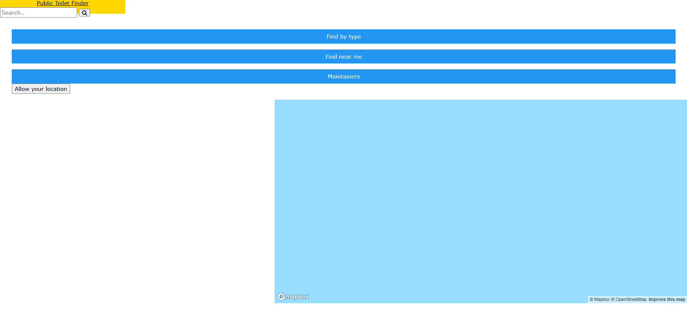
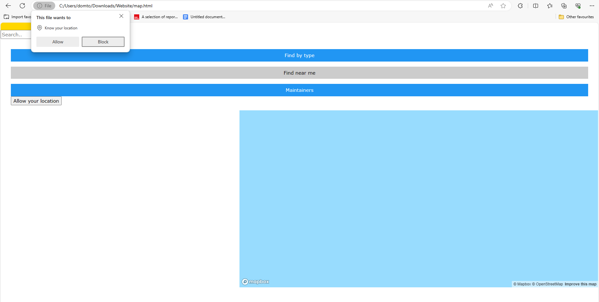
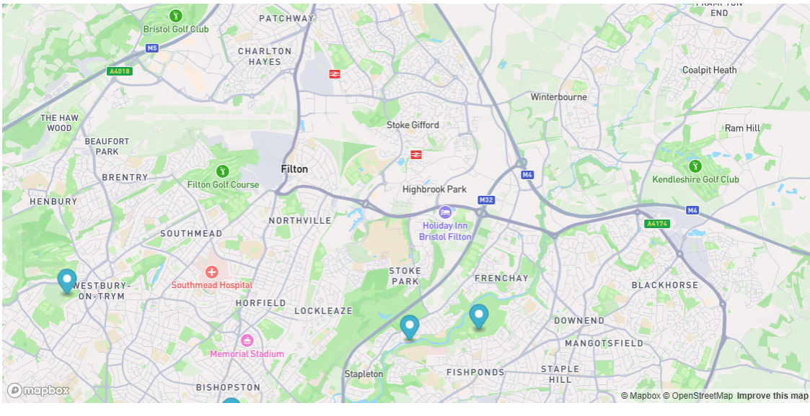
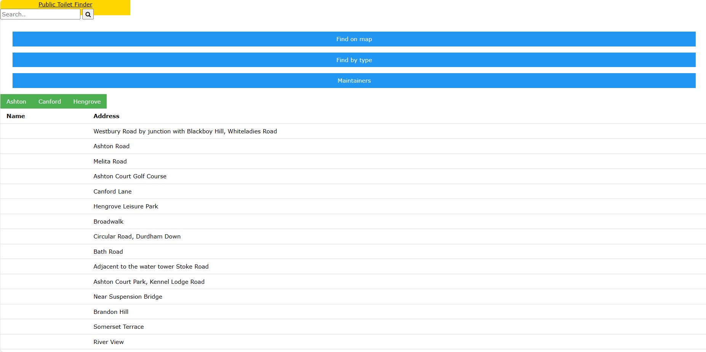
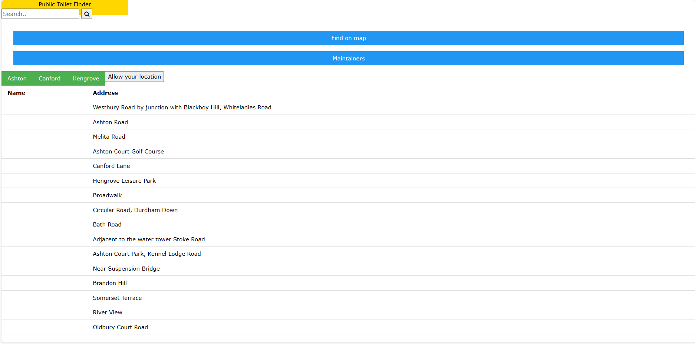

# Deployment

## Release Notes
Version 1.0.0  
The system is very bare, with very few to almost no non functional requirements being fufilled.  
The system depends on having a computer in order to collect the user's location or even have a preset one, however the map is still interactable.  
Issues include:  
- The location not defaulting to the city centre when permissions are denied  
- The heading and header not going across the whole screen and interfering visually with the search bar  
- The maintainers page not going anywhere  
- The types table not being aligned properly and the filters not working  

# User guide
TODO: Explain how each use-case works by providing step-by-step screenshots for each use-case. This should be based on a tested scenario.
UC1:

The above is the splash page that would first be loaded, users would first be greeted by this page. Then, they would click on "find by map", leading them to the following page below.  

This is what the "find by map" button will lead to, where the user will then click on the "Allow your location button" in order to view the nearest toilet on the map. 

The above is what it'd look like once the user presses the button.  

This above is what the map would now look like, letting the user view the markers closest to them and move the map around if they're unsatisfied with the location of the toilet. 
 
UC2:

The above is the splash page that would first be loaded, users would first be greeted by this page. Then, they would click on "find by type", leading them to the following page below.  

The above is what the "type" page looks like, however unfortunately allowing location does nothing, and the user wouldn't be able to view the distance from the toilet to the user.
