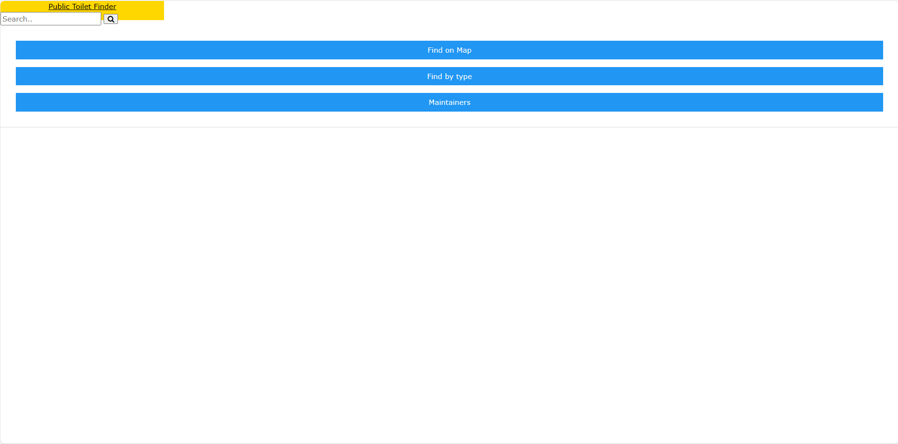
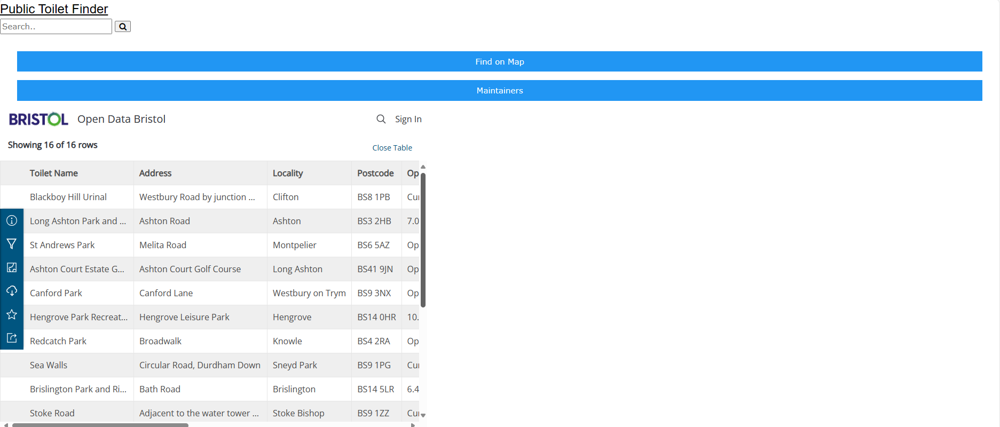
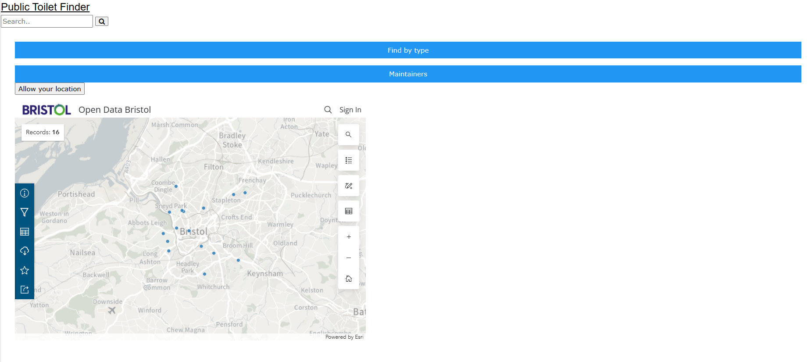

# Design

## User Interface design
The following below shows the intended and planned display for both "Map mode" and "Location mode"  

 
The mobile version would have the same format as the PC version, as well as the same size, and the user would just use pinch to zoom and scroll with their fingers.  
The PC version would have buttons in order to see the "map" version or the "type" version, a colour change of some sorts in order to let the user know what type they're currently on.  
The search bar will allow the user to locate a specific toilet if they know its vague information such as general location.  
A form element will not be necessary, as our wireframes don't include it as it'd clutter up the page and make it look less compact and clean. The search bar, for now, simply brings you to the index page/refreshes the index page. 

 
This (above) is a screenshot of the Index page currently, hopefully it will be fixed and cleaned up in the future.  
The buttons lead to the individual pages, below are the map pages and the type pages. 

 
This (above) is a screenshot of the Type page currently, the formatting should be fixed at a later date.  

 
This (above) is a screenshot of the Map page currently.
