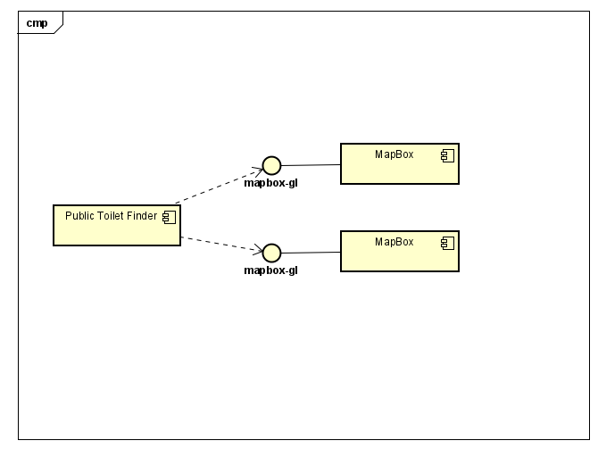
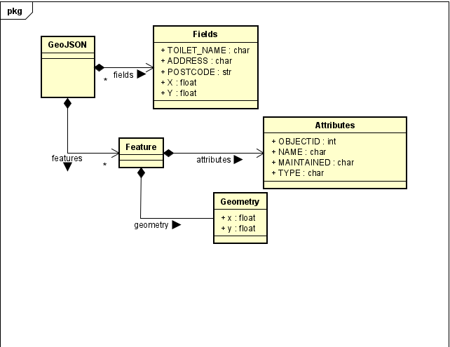

# Implementation

## Introduction
The dataset, according to OpenDataBristol, may not be fully up to date, and they might not be completely accurate. For example, toilets in public stores or shopping centres may not be included, and the coordinates of the toilets that are included may not be 100% accurate. Some data, such as gendered toilets or their opening times have also been omitted. <br>

## Project Structure
```
└── 📁Website
    └── designIndex.png
    └── designMap.png
    └── designType.png
    └── designWireframes.png
    └── distance.html
    └── index.html
    └── map.html
    └── style.css
    └── type.html
    └── UseCaseDiagram.png
```
The png's are all the current images used to document the efforts so far. <br>
The distance.html file should be the first page opened, leading to both type.html and map.html. <br>
type.html leads to the table containing addresses, while map.html leads to the map version. <br>
style.css is where all the CSS is stored. <br>

## Software Architecture
The main important components here are Bristol Open Data and 



## Bristol Open Data API
TODO: Document each query to Bristol Open Data


TODO: Repeat as necessary
