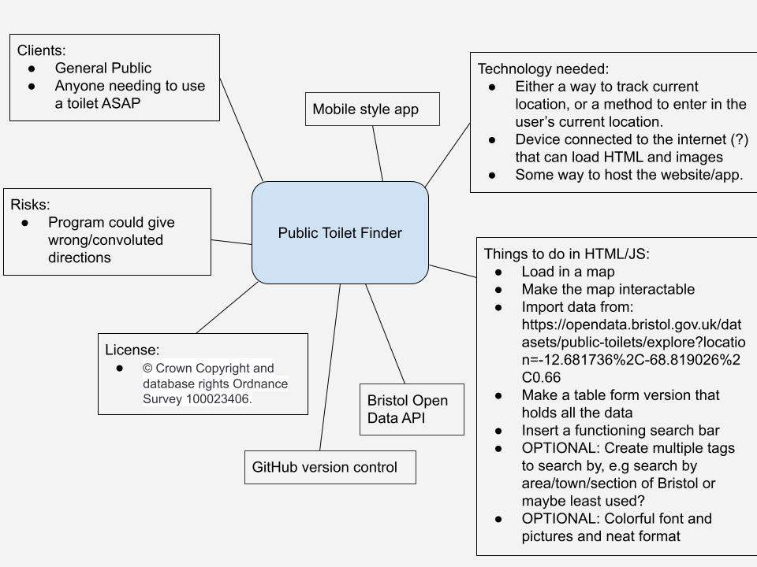

# Project Proposal

## Business Case

### Problem statement
This project aims to help people find public toilets close to them.

### Business benefits
Assist people finding toilets and display ads to create profit.

### Options Considered
Google maps
Other public toilet finders

### Expected Risks
Application could potentially make the user take longer or incorrect routes or even choose the wrong toilet.

## Project Scope
TODO: Scope of the System of Interest. Include a bullet list of things from your context diagram that are in scope.

